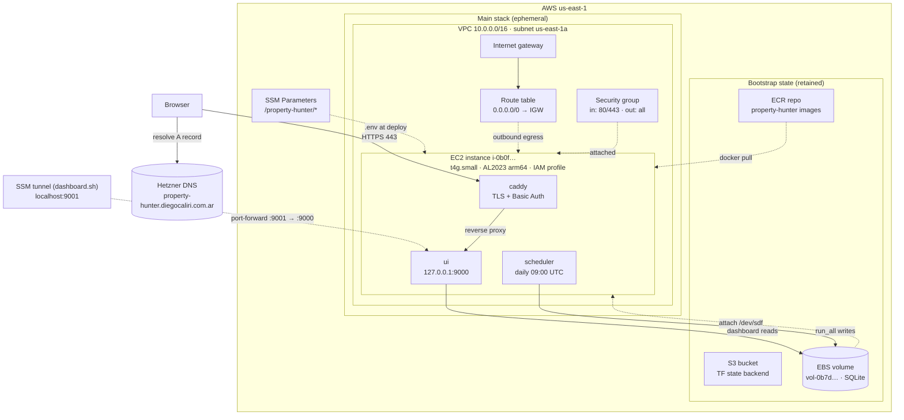
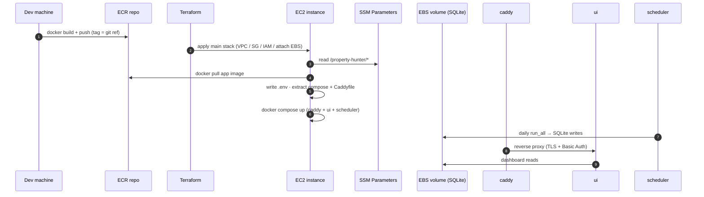

# AWS Resources: Inventory & Relationships

Complete map of the AWS resources created by `property-hunter`'s cloud
lifecycle, how they connect, and what happens to each one across the
`up`/`down` cycle. See [quickstart.md](quickstart.md) for the operational flow
and [research.md](research.md) for the decisions behind this design.

- Account: `233202648181`
- Region / AZ: `us-east-1` / `us-east-1a` (AZ is pinned to the EBS volume)
- Stack layer: two independent Terraform states — **bootstrap** (retained) and
  **main** (ephemeral). `down.sh` destroys only the main stack.

## Architecture at a glance

## 1. Bootstrap stack (retained — never deleted by `down`)

Created once by `bootstrap.sh`. Protected with `prevent_destroy`; `down.sh`
explicitly leaves them intact and `up.sh` reuses them every cycle.

| Resource | Name / ID | Purpose |
| --- | --- | --- |
| S3 bucket | `property-hunter-233202648181` | Terraform **state backend** for the main stack. Versioning enabled + SSE-AES256; `force_destroy = false` |
| EBS volume | `vol-0b7ddd5f66f896dfb` | App data: SQLite DB, 10 GiB `gp3`, tagged `Name=property-hunter-data`. Detaches on `down`, reattaches on `up` — the data survives |
| ECR repository | `233202648181.dkr.ecr.us-east-1.amazonaws.com/property-hunter` | Deploy artifact target. Images are pushed from the dev machine and pulled on the instance. `scan_on_push = true` (Inspector) |

Supporting resources in the bootstrap state: bucket versioning config,
bucket SSE config, and the `outputs.tf` values (`state_bucket`, `data_volume_id`,
`data_volume_size_gb`, `availability_zone`, `ecr_repository_url`) recorded in
`infra/aws/.bootstrap.env`.

## 2. Main stack (ephemeral — created/destroyed each `up`/`down`)

All of these are torn down by `down.sh` and re-provisioned by `up.sh`.

### 2.1 Networking

| Resource | ID | Details |
| --- | --- | --- |
| VPC | `vpc-0456176f1fcdfa38d` | `10.0.0.0/16`, DNS hostnames enabled |
| Subnet | `subnet-09d637e287f2674e7` | `10.0.0.0/24` in `us-east-1a` (pinned to the EBS AZ) |
| Internet gateway | `igw-094716172f70e6f00` | Attached to the VPC |
| Route table (main) | `rtb-023515ab1efb4ca67` | Default route `0.0.0.0/0 → igw` (outbound egress) |
| Route table association | — | Subnet ↔ route table |

**Note on ingress**: the route/IGW only provide *outbound* egress. Inbound is
controlled solely by the security group, which is the only path in.

### 2.2 Security group

`sg-09e5d25824872d0e3` (`property-hunter`)

| Direction | Rule | Why |
| --- | --- | --- |
| Inbound | `TCP 80` from `0.0.0.0/0` | Caddy HTTP→HTTPS redirect + Let's Encrypt HTTP-01 challenge |
| Inbound | `TCP 443` from `0.0.0.0/0` | Public HTTPS access to the dashboard (behind Caddy's Basic Auth) |
| Outbound | `all` to `0.0.0.0/0` | SSM, ECR pulls, package installs, app collection traffic |

Only these two ports are open. The UI container binds `127.0.0.1:9000` on the
instance and is never exposed directly; Caddy proxies to it over Docker's
internal network. `description` is intentionally frozen (changing it forces an
SG replacement in the provider).

### 2.3 IAM (instance identity)

| Resource | Name | Purpose |
| --- | --- | --- |
| Instance profile | `property-hunter-profile` | Attached to the EC2 instance; the only credential the instance has |
| Role | `property-hunter-role` | Assumed by EC2; no keys exist anywhere |
| Managed policy | `AmazonSSMManagedInstanceCore` | Session Manager registration → SSM port-forward & send-command access |
| Managed policy | `AmazonEC2ContainerRegistryReadOnly` | Pull app images from ECR |
| Custom policy | `property-hunter-ssm-params` | Read + decrypt `/property-hunter/*` SSM parameters (uses the default `aws/ssm` KMS key) |

### 2.4 Compute + storage

| Resource | ID | Details |
| --- | --- | --- |
| EC2 instance | `i-0b0f028a34e1b6b73` | `t4g.small`, Amazon Linux 2023 **arm64** AMI (`ami-0da34a447df8ced30` at apply time), public IP `3.234.254.59`. **No key pair** — all access is SSM |
| Volume attachment | `/dev/sdf` | Attaches the retained EBS volume to the instance; `down` detaches only |
| Docker named volumes | `property-hunter_caddy_data`, `property-hunter_caddy_config` | Caddy's Let's Encrypt certs + config live on the **root volume** (not EBS), so certs re-issue automatically after each `up` |

### 2.5 Configuration & secrets

| Resource | Detail |
| --- | --- |
| SSM Parameter Store | 28 parameters under `/property-hunter/*` (`SecureString`, encrypted with the default `aws/ssm` KMS key) — the app's full `.env`. Categories: scope, collection politeness, scheduler cron, SMTP, optional LLM, ML thresholds, and `UI_BASIC_AUTH_USER` / `UI_BASIC_AUTH_HASH` for Caddy |
| EC2 `user_data` | Runs `remote-deploy.sh` on first boot (bootstrap only; later deploys ship the script over SSM). Marked `ignore_changes` so edits don't churn the instance/public IP |

### 2.6 Containers (on the instance, via `docker-compose.cloud.yml`)

| Container | Image | Binds | Role |
| --- | --- | --- | --- |
| `caddy` | `caddy:2` | `80`, `443` (host) | TLS termination, Basic Auth popup, reverse proxy → `ui:9000` |
| `ui` | app image | `127.0.0.1:9000` (host) | Read-only dashboard; SQLite via EBS mount |
| `scheduler` | app image | — | Daily `run_all` cron (APScheduler, `09:00 UTC`); SQLite via EBS mount |

## 3. How they connect (data flow)

1. **Build & ship** — `docker build` on the dev machine → `docker push` to ECR
   (tagged by git ref, e.g. `9121b9a`).
2. **Provision** — `up.sh` applies the main stack: VPC/subnet/IGW/route → SG →
   IAM → instance (with the EBS volume reattached). The instance boots, SSM
   registers, and `user_data` runs `remote-deploy.sh`.
3. **Deploy** — `remote-deploy.sh` pulls the IAM-permitted image from ECR,
   reads `/property-hunter/*` into `.env`, extracts the compose file + Caddyfile
   from the image, and starts `caddy` + `ui` + `scheduler`. Deploys/rollbacks
   reuse this same path over SSM (`deploy.sh --ref`) without re-provisioning.
4. **Run** — the scheduler fires the daily cron; the pipeline writes listings,
   observations, predictions, etc. into SQLite on the EBS volume
   (`/opt/property-hunter/data`, mounted into both containers).
5. **Read** — two access paths to the dashboard:
   - **Public**: browser → `property-hunter.diegocaliri.com.ar` (Hetzner DNS) →
     instance `443` → Caddy (HTTPS + Basic Auth) → `ui:9000` → SQLite.
   - **Private**: SSM port-forward (`dashboard.sh`) → instance `127.0.0.1:9000`
     → `ui:9000` → SQLite. No inbound rules needed.

## 4. Security posture

- **No SSH / no key pair** — the only control path is authenticated SSM
  (Session Manager), backed by IAM.
- **No inbound traffic except 80/443**, and those terminate at Caddy, which
  enforces HTTPS + HTTP Basic Auth before the UI is ever reached.
- **Secrets never in the repo** — `.env` is git-ignored; real values live in
  SSM `SecureString` (KMS-encrypted) and are written to the instance only at
  deploy time.
- **State at rest** — the S3 state bucket is versioned and SSE-AES256
  encrypted.
- **Data retention** — the SQLite volume can only detach, never be destroyed,
  from the main stack's state (`down --wipe-data` is the explicit escape hatch).

## 5. Lifecycle summary

| Resource | `up.sh` | `down.sh` | destroyed on `down`? |
| --- | --- | --- | --- |
| S3 bucket, EBS volume, ECR repo | reused | kept (detached) | **never** |
| VPC / subnet / IGW / route table | created | deleted | yes |
| Security group | created | deleted | yes |
| IAM profile / role / policies | created | deleted | yes |
| EC2 instance (incl. root volume, Docker volumes) | created | terminated | yes |
| SSM parameters | read | kept | **never** (not managed by TF) |
| Docker containers | started | stopped | yes (with instance) |

> The EBS volume bills while detached (~$0.80/mo at 10 GiB) — that's the cost
> of keeping data across `down` cycles, as designed in research §2.
